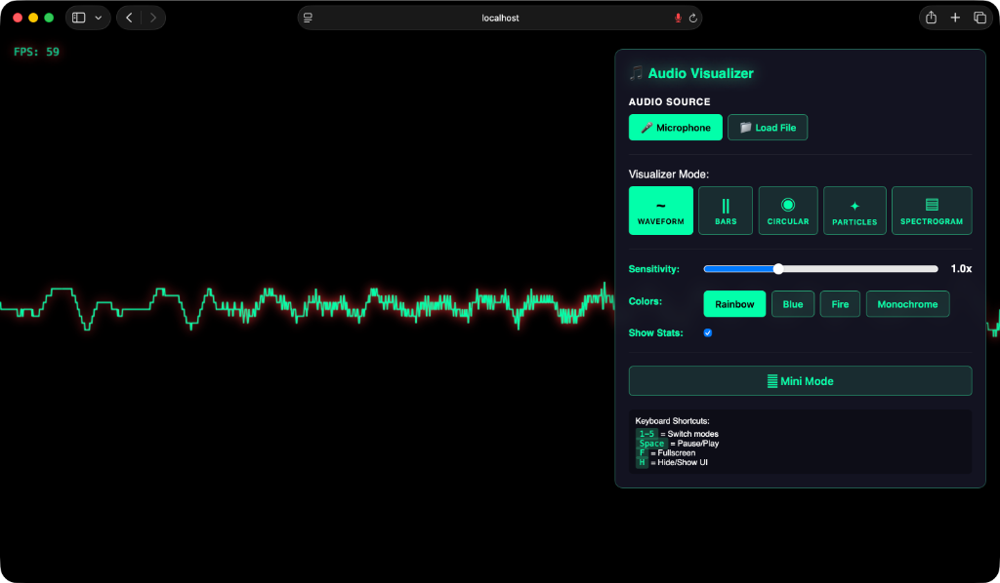
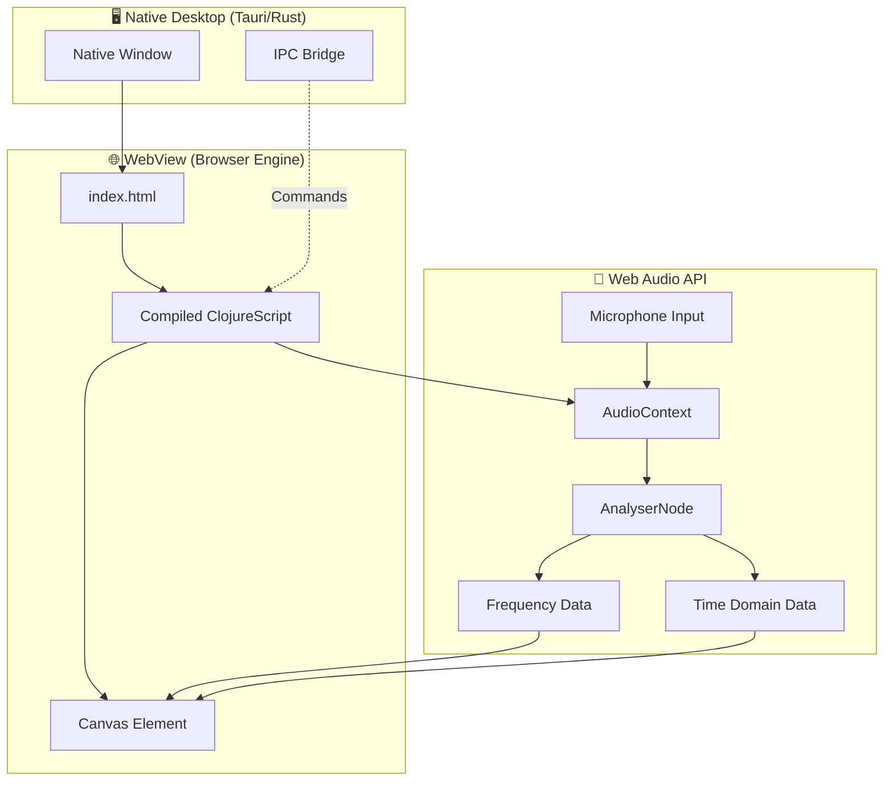
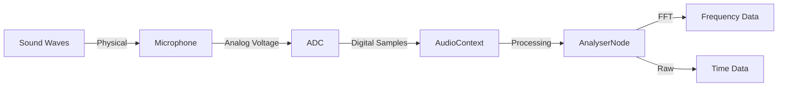
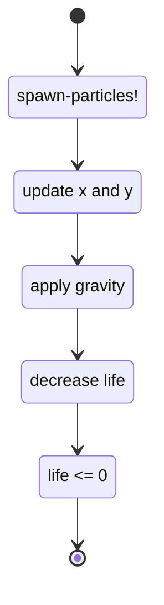
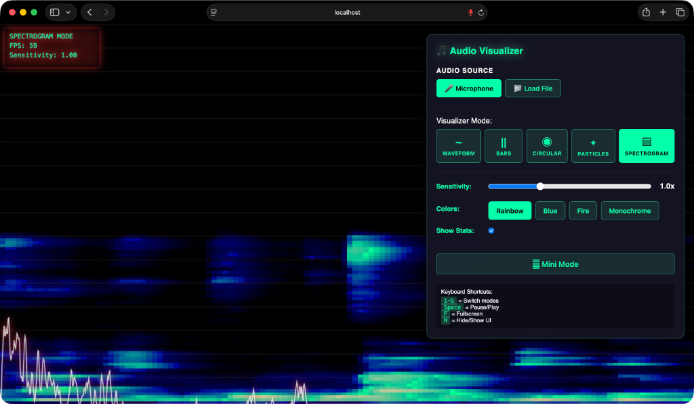
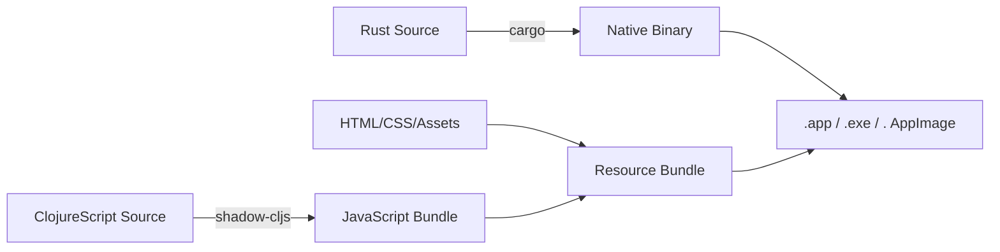

<!--
#book #chapter10
-->
# Building an Audio Visualizer with ClojureScript and Tauri: The Penthouse Suite

> "At the top floor of our hotel, where the city's rhythm becomes visible light, we discover that sound is just data dancing to its own frequency."

## Welcome to the Penthouse

This is the final chapter, the penthouse floor at the top of our journey. We're not just building a web application anymore. We're crossing into **native desktop territory** using Tauri, the Rust-powered framework that wraps our ClojureScript in a real operating system window. We're tapping into the **Web Audio API** to capture sound from your microphone in real-time. And we're rendering **five different visual interpretations** of that audio data, each one a different lens through which to see sound.


**Figure 10-1**: Audio visualizer penthouse suite showing native desktop application with real-time sound visualization

## The Big Picture: System Architecture

Before we dive into code, let's understand how all the pieces fit together. This is no longer a simple single-page app. This is a **hybrid system** with three distinct layers:


**Figure 10-2**: Three-layer hybrid architecture combining Tauri/Rust for native OS integration, ClojureScript for logic, and Web Audio API for sound processing

**Three worlds, one application:**

1. **Tauri/Rust Layer**: Creates a native OS window, handles file system access, manages the application lifecycle
2. **ClojureScript Layer**: Your familiar functional code, compiled to JavaScript
3. **Web Audio Layer**: Browser APIs for capturing and analyzing sound in real-time

The beauty? Each layer does what it does best. Rust handles the heavy native integration. ClojureScript manages state and rendering logic. The Web Audio API processes the acoustic physics.

## The Hotel's Final Lesson

Throughout this book, we've built with an **incremental philosophy**. Start simple. Add complexity only when needed. Test constantly. This chapter is the culmination of that approach.

We're building **five visualizers**, each in its own namespace:
- `e01.cljs` - **Waveform**: The oscilloscope view, raw time-domain data
- `e02.cljs` - **Frequency Bars**: Classic spectrum analyzer
- `e05.cljs` - **Circular Spectrum**: Radial arrangement of frequencies
- `e06.cljs` - **Particles**: Physics-based reactive particles
- `e07.cljs` - **Spectrogram**: Scrolling heatmap of frequency history

Each visualizer is **independent** but shares **common state**. This is a masterclass in functional architecture—shared data, isolated behavior.

## Part I: The Foundation - Setting Up Tauri

### Why Tauri?

Remember in earlier chapters when we ran `npx shadow-cljs watch app` and opened a browser tab? That worked because we were building web applications. But web apps have limitations:

- Can't access the file system deeply
- Can't run system commands
- Can't create menu bars or system tray icons
- Always need a browser window frame

**Tauri changes the game**. It's like Electron (which you may know from VS Code, Slack, Discord) but faster and smaller. How? By using your operating system's built-in web rendering engine instead of bundling an entire Chromium browser.

| Feature | Electron | Tauri | Our App |
|---------|----------|-------|---------|
| Language | JavaScript | Rust + JS | ClojureScript + Rust |
| Bundle Size | ~120MB | ~3MB | ~3MB ✅ |
| Memory | ~100MB | ~30MB | ~30MB ✅ |
| Startup | Slow | Fast | Fast ✅ |
| Security | Weak | Strong | Strong ✅ |
**Table 10-1**: Performance comparison between Electron and Tauri showing significant advantages in bundle size, memory usage, and security

### Project Structure

Let's look at how a Tauri + ClojureScript project is organized:

```
10-audio-visualizer/
├── src/                    # ClojureScript source
│   └── myapp/
│       ├── core.cljs      # Entry point & keyboard handling
│       ├── state.cljs     # Shared state & audio setup
│       ├── e01.cljs       # Waveform visualizer
│       ├── e02.cljs       # Frequency bars
│       ├── e05.cljs       # Circular spectrum
│       ├── e06.cljs       # Particles
│       ├── e07.cljs       # Spectrogram
│       └── e08.cljs       # UI controls & mode switching
│
├── src-tauri/             # Rust/Tauri source
│   ├── Cargo.toml         # Rust dependencies
│   ├── tauri.conf.json    # Tauri configuration
│   └── src/
│       └── main.rs        # Rust entry point
│
├── public/                # Static assets
│   └── index.html         # HTML shell
│
├── shadow-cljs.edn        # ClojureScript build config
└── package.json           # NPM dependencies
```

Notice the **dual nature**: `src/` for ClojureScript, `src-tauri/` for Rust. They're two separate programs that communicate through Tauri's IPC (Inter-Process Communication) bridge.

### Configuration: shadow-cljs.edn

```clojure
{:source-paths ["src"]
 :dependencies [[reagent/reagent "2.0.1"]]
 :dev-http {8001 "public"}
 :builds {:app {:target :browser
                :output-dir "public/js"
                :asset-path "/js"
                :modules {:main {:init-fn myapp.core/init
                                 :entries [myapp.core]}}}}}
```
**Listing 10-1**: Shadow-cljs Tauri configuration with port 8001 dev server, Reagent dependency, and browser target matching native window expectations

**Key differences from earlier chapters:**

- **Port 8001**: Tauri expects the dev server here (configurable in `tauri.conf.json`)
- **Reagent**: We're using React integration for the UI controls
- **No `:entries`**: We let shadow-cljs auto-discover from `:init-fn`

### Configuration: tauri.conf.json

This is the Rust side of the house:

```json
{
  "build": {
    "beforeBuildCommand": "npx shadow-cljs release app",
    "frontendDist": "../public",
    "devUrl": "http://localhost:8001"
  },
  "bundle": {
    "active": true,
    "icon": ["icons/32x32.png", "icons/128x128.png", "icons/128x128@2x.png",
             "icons/icon.icns", "icons/icon.ico"],
    "targets": "all"
  },
  "productName": "Audio Visualizer",
  "version": "0.1.0",
  "identifier": "com.cajuns.audio-visualizer",
  "app": {
    "windows": [{
      "title": "Audio Visualizer",
      "width": 1200,
      "height": 800,
      "resizable": true,
      "fullscreen": false,
      "decorations": true,
      "useHttpsScheme": true
    }],
    "trayIcon": {
      "iconPath": "icons/icon.png",
      "iconAsTemplate": true
    },
    "security": { "csp": null }
  }
}
```
**Listing 10-2**: Tauri configuration JSON defining native window properties, dev server integration, and build commands for Rust/ClojureScript coordination

**The dance:** When you run `npm run tauri dev`:
1. Tauri executes `beforeDevCommand` → Starts shadow-cljs watch server on 8001
2. Tauri opens a native window
3. Tauri loads `http://localhost:8001` in that window
4. Shadow-cljs watches for changes, hot-reloads instantly

It's **native performance** with **web development ergonomics**. Best of both worlds.

## Part II: The Audio Pipeline - Web Audio API

Now we enter the realm of digital signal processing. Don't worry—you don't need a PhD in acoustics. The Web Audio API abstracts the hard parts beautifully.

### How Sound Becomes Data

When you speak into a microphone, here's what happens:


**Figure 10-3**: Audio pipeline from physical sound waves through microphone, ADC, AudioContext, to FFT frequency analysis

1. **Sound waves** (pressure variations in air) hit your microphone
2. **Analog-to-Digital Converter** (ADC) samples the voltage 48,000 times per second
3. **AudioContext** manages these samples as a stream
4. **AnalyserNode** performs **Fast Fourier Transform** (FFT) to extract frequency information

**FFT** is the magic spell. It converts time-domain data (amplitude over time) into frequency-domain data (which frequencies are present). Think of it like a prism splitting white light into a rainbow—but for sound.

### The State Architecture

All audio state lives in one Reagent atom in `state.cljs`:

```clojure
(defonce app-state
  (r/atom {;; Audio context
           :audio-context nil
           :analyser nil
           :data-array-time nil      ; Time domain data (waveform)
           :data-array-freq nil      ; Frequency domain data (spectrum)
           :animation-frame nil
           :started? false

           ;; Audio source
           :source-type :microphone   ; :microphone or :file
           :audio-source nil
           :media-stream nil          ; Store stream to stop it later
           :audio-buffer nil
           :current-file nil

           ;; Visualizer settings
           :mode :circular
           :sensitivity 1.0
           :color-scheme :rainbow     ; :rainbow, :blue, :fire, :monochrome
           :show-stats true
           :show-ui true
           :mini-mode false

           ;; Performance
           :fps 60
           :last-frame-time 0

           ;; Beat detection
           :beat-history []
           :last-beat-time 0

           ;; Mode-specific data
           :particles []
           :spectrogram-buffer []}))
```
**Listing 10-3**: Centralized Reagent atom serving as single source of truth for audio context, analyser nodes, typed data arrays, mode selection, and visualizer-specific state shared across all five visualizers

**This is the single source of truth**. All five visualizers read from this atom. When audio data arrives, we `swap!` it in. When the user changes modes, we `swap!` the `:mode` key. Pure functional state management at scale.

### Audio Setup: The Tricky Part

Getting microphone access is **asynchronous**. The browser must ask for permission, the user must grant it, then we get a stream. Classic JavaScript Promise territory. Here's how we handle it functionally:

```clojure
(defn setup-analyser! []
  "Setup or reuse existing analyser. Auto-connects to microphone on first call."
  (if-let [existing (:analyser @app-state)]
    ;; Already set up, return immediately
    existing
    ;; Need to create analyser and request mic
    (let [ctx (get-audio-context)
          analyser (.createAnalyser ctx)]
      ;; Configure FFT size (trade-off: larger = better freq resolution but slower)
      (set! (.-fftSize analyser) 2048)
      (set! (.-smoothingTimeConstant analyser) 0.8)

      ;; Create data arrays
      (let [buffer-length-time (.-fftSize analyser)
            buffer-length-freq (.-frequencyBinCount analyser)
            data-time (js/Uint8Array. buffer-length-time)
            data-freq (js/Uint8Array. buffer-length-freq)]
        (swap! app-state assoc
               :analyser analyser
               :data-array-time data-time
               :data-array-freq data-freq))

      ;; Request microphone (async!)
      (when-not (:started? @app-state)
        (-> (js/navigator.mediaDevices.getUserMedia #js {:audio true})
            (.then (fn [stream]
                     (let [source (.createMediaStreamSource ctx stream)]
                       (.connect source analyser)
                       (swap! app-state assoc
                              :started? true
                              :media-stream stream
                              :audio-source source)
                       (js/console.log "✅ Microphone connected!"))))
            (.catch (fn [err]
                      (js/console.error "❌ Microphone access denied:" err)))))

      analyser)))
```
**Listing 10-4**: Singleton microphone setup implementing lazy initialization with promise-based getUserMedia, FFT analyser configuration, Uint8Array buffer allocation, and MediaStreamSource connection for Web Audio API pipeline

**Key concepts:**

| Concept | Value | Why |
|---------|-------|-----|
| **fftSize** | 2048 | Must be power of 2. Larger = better frequency resolution but slower. 2048 gives us 1024 frequency bins. |
| **smoothingTimeConstant** | 0.8 | Temporal smoothing (0-1). Higher = smoother but less responsive. |
| **frequencyBinCount** | fftSize ÷ 2 | Always half the FFT size. Each bin represents a frequency range. |
**Table 10-2**: FFT configuration parameters explaining fftSize, smoothingTimeConstant, and frequencyBinCount trade-offs

**The Singleton Pattern**: Notice we check for `existing` first. We only want **one** audio context, one analyser. Creating multiple would waste resources and create audio glitches.

### Data Arrays: Uint8Array Explained

```clojure
(js/Uint8Array. 2048)
```

This creates a typed array—a fixed-size, efficient buffer for numeric data. Unlike JavaScript arrays which can hold anything, typed arrays are:
- **Faster** (direct memory access)
- **Smaller** (packed tightly)
- **Typed** (only unsigned 8-bit integers, 0-255)

Audio data arrives as values 0-255. This maps perfectly to color intensities, bar heights, particle speeds. The Web Audio API fills these arrays; we just read them.

## Part III: The Visualizers - Five Perspectives on Sound

Each visualizer is a separate namespace with the same structure:

```clojure
(ns myapp.e0X
  (:require [myapp.state :as state]))

(defn draw-loop! []
  (letfn [(draw []
            (when (= (:mode @state/app-state) :visualizer-name)
              ;; Get audio data
              ;; Clear canvas
              ;; Draw visualization
              ;; Schedule next frame
              (swap! state/app-state assoc :animation-frame
                     (js/requestAnimationFrame draw))))]
    (draw)))

(defn start! []
  (when-let [analyser (state/setup-analyser!)]
    (draw-loop!)))
```
**Listing 10-5**: Visualizer namespace template pattern with mode guard clause preventing zombie animation loops and requestAnimationFrame recursion structure

**The guard clause** `when (= (:mode @app-state) :visualizer-name)` is critical. It prevents **zombie loops**—old visualizers continuing to run after a mode switch. Each frame checks: "Am I still the active visualizer?" If not, stop.

### Visualizer 1: Waveform (e01.cljs)

The waveform shows **time-domain data**—the raw oscillation of the microphone signal. This is what an oscilloscope displays.

```clojure
(defn draw-loop! []
  (let [canvas (state/get-canvas)
        ctx (state/get-canvas-context)]
    (when-let [analyser (:analyser @state/app-state)]
      (let [data-array (:data-array-time @state/app-state)
            w (.-width canvas)
            h (.-height canvas)]
        (letfn [(draw []
                  (when (= (:mode @state/app-state) :waveform)
                    ;; Schedule next frame first
                    (swap! state/app-state assoc :animation-frame
                           (js/requestAnimationFrame draw))

                    ;; Get waveform data
                    (.getByteTimeDomainData analyser data-array)

                    ;; Clear background
                    (state/clear-canvas! ctx w h)

                    ;; Draw waveform line
                    (set! (.-lineWidth ctx) 2)
                    (set! (.-strokeStyle ctx) "#00FFAA")
                    (.beginPath ctx)

                    (let [slice (/ w (.-length data-array))]
                      (loop [i 0, x 0]
                        (when (< i (.-length data-array))
                          (let [v (/ (aget data-array i) 128.0)
                                ;; Soft clamping using tanh for smooth curves
                                deviation-raw (* (- v 1) h 2)
                                deviation (* (js/Math.tanh (/ deviation-raw h)) h 0.8)
                                y (+ (/ h 2) deviation)]
                            (if (zero? i)
                              (.moveTo ctx x y)
                              (.lineTo ctx x y))
                            (recur (inc i) (+ x slice))))))

                    (.lineTo ctx w (/ h 2))
                    (.stroke ctx)

                    ;; Stats overlay
                    (state/measure-fps!)
                    (when (:show-stats @state/app-state)
                      (set! (.-fillStyle ctx) "rgba(0, 255, 180, 0.8)")
                      (set! (.-font ctx) "16px monospace")
                      (.fillText ctx (str "FPS: " (:fps @state/app-state)) 20 30))))]
          (draw))))))
```
**Listing 10-6**: Waveform oscilloscope visualizer using getByteTimeDomainData for raw audio signal with tanh soft-clamping preventing harsh clipping artifacts creating smooth wave contours

**The math breakdown:**

1. **Normalize**: `v = sample ÷ 128` converts 0-255 → 0-2 range
2. **Center**: `(- v 1)` shifts to -1 to +1 (zero-centered)
3. **Amplify**: `* h 2` makes oscillations visible
4. **Soft clamp**: `tanh(x)` creates smooth S-curve, preventing blocky clipping
5. **Position**: `(+ (h/2) deviation)` places on canvas

**Why tanh?** The hyperbolic tangent function gracefully compresses extreme values while leaving normal values untouched. It's the difference between a brick wall and a cushion.

```
Input:  -3  -2  -1   0   1   2   3
tanh:  -1  -0.96 -0.76  0  0.76  0.96  1
```

Notice how it approaches ±1 asymptotically? That's smooth clamping.

### Visualizer 2: Frequency Bars (e02.cljs)

This is the classic spectrum analyzer—think car stereos, Winamp, iTunes visualizers. Each bar represents a frequency range.

```clojure
(defn draw-frequency-loop! []
  (let [canvas (state/get-canvas)
        ctx (state/get-canvas-context)]
    (when-let [analyser (:analyser @state/app-state)]
      (let [data-array (:data-array-freq @state/app-state)
            w (.-width canvas)
            h (.-height canvas)]
        (letfn [(draw []
                  (when (= (:mode @state/app-state) :bars)
                    ;; Schedule next frame first
                    (swap! state/app-state assoc :animation-frame
                           (js/requestAnimationFrame draw))

                    ;; Get frequency data
                    (.getByteFrequencyData analyser data-array)

                    ;; Clear
                    (state/clear-canvas! ctx w h)

                    ;; Draw bars
                    (let [num-bars (.-length data-array)
                          bar-width (/ w num-bars)
                          bar-gap 1]
                      (loop [i 0, x 0]
                        (when (< i num-bars)
                          (let [v (aget data-array i)
                                bar-height (* v (/ h 256))]
                            ;; Bright rainbow colors
                            (let [hue (* 360 (/ i num-bars))
                                  brightness (+ 50 (* 20 (/ v 255)))]
                              (set! (.-fillStyle ctx)
                                    (str "hsl(" hue ", 100%, " brightness "%)")))

                            ;; Strong glow
                            (set! (.-shadowBlur ctx) 15)
                            (set! (.-shadowColor ctx)
                                  (str "hsl(" (* 360 (/ i num-bars)) ", 100%, 60%)"))

                            (.fillRect ctx x (- h bar-height)
                                       (- bar-width bar-gap) bar-height))
                          (recur (inc i) (+ x bar-width)))))

                    ;; Stats overlay
                    (state/measure-fps!)
                    (when (:show-stats @state/app-state)
                      (set! (.-fillStyle ctx) "rgba(0, 255, 180, 0.8)")
                      (set! (.-font ctx) "16px monospace")
                      (.fillText ctx (str "FPS: " (:fps @state/app-state)) 20 30))))]
          (draw))))))
```
**Listing 10-7**: Classic spectrum analyzer with vertical frequency bars using HSL rainbow gradient from red (bass) through green (mid) to blue (treble) with shadow glow effects

**Color theory in action:**

| Frequency | Hue | Color | Why |
|-----------|-----|-------|-----|
| Low (bass) | 0° | Red | Warm, powerful |
| Mid | 120° | Green | Balanced |
| High | 240° | Blue | Cool, sharp |
**Table 10-3**: Color theory mapping showing frequency bands to HSL hues for intuitive visual representation

We use **HSL** (Hue, Saturation, Lightness) instead of RGB because it lets us sweep through the rainbow by simply incrementing hue from 0° to 360°.

**The shadow/glow trick:** Setting `shadowBlur` and `shadowColor` before drawing creates a glow effect. The shadow is drawn *behind* the fill, creating the illusion of light emission.

### Visualizer 3: Circular Spectrum (e05.cljs)

Instead of vertical bars, we arrange them radially around a center point. This creates a mesmerizing mandala effect.

```clojure
(let [num-bars (.-length data-array)
      sum (reduce + (map #(aget data-array %) (range num-bars)))
      avg (/ sum num-bars)
      norm (/ avg 255.0)
      base-inner-radius (+ 20 (* norm 80))]

  ;; Draw radial bars
  (set! (.-shadowBlur ctx) 0)
  (set! (.-lineWidth ctx) 2)

  (let [angle-step (/ (* 2 Math/PI) num-bars)]
    (loop [i 0]
      (when (< i num-bars)
        (let [v (aget data-array i)
              bin-norm (/ v 255.0)
              bar-length (* 0.85 (+ 50 (* bin-norm max-radius)))
              angle (* i angle-step)

              ;; Polar → Cartesian conversion
              x-start (+ center-x (* base-inner-radius (Math/cos angle)))
              y-start (+ center-y (* base-inner-radius (Math/sin angle)))
              x-end (+ center-x (* bar-length (Math/cos angle)))
              y-end (+ center-y (* bar-length (Math/sin angle)))

              ;; Rainbow color
              hue (mod (* 360 (/ i num-bars)) 360)
              lightness (+ 30 (* 50 bin-norm))]

          (set! (.-strokeStyle ctx)
                (str "hsl(" hue ", 100%, " lightness "%)"))
          (.beginPath ctx)
          (.moveTo ctx x-start y-start)
          (.lineTo ctx x-end y-end)
          (.stroke ctx))

        (recur (inc i))))))
```
**Listing 10-8**: Circular spectrum visualizer arranging frequency bars radially around pulsing center using polar-to-Cartesian conversion creating mesmerizing mandala effect

**Polar coordinate math refresher:**

```
x = center_x + radius × cos(angle)
y = center_y + radius × sin(angle)
```

We're drawing from an inner circle (the "pulse" that grows with average volume) to an outer position determined by each frequency bin's amplitude.

**The "pulse" effect:** `base-inner-radius = 20 + (avg × 80)` makes the center circle grow and shrink with overall loudness. Try humming loudly—you'll see the center expand!

### Visualizer 4: Particles (e06.cljs)

Now we enter **physics simulation** territory. Particles are born, move according to velocity, affected by gravity, and fade out over time.

```clojure
(defn create-particle [x y vx vy color life]
  {:x x :y y :vx vx :vy vy :color color :life life})

(defn update-particle [p]
  (when (> (:life p) 0)
    (-> p
        (update :x + (:vx p))
        (update :y + (:vy p))
        (update :vy + 0.2)     ;; Gravity!
        (update :life - 0.01))))

(defn spawn-particles! [freq-data canvas-width canvas-height]
  (let [bass (/ (aget freq-data 2) 255.0)
        mid (/ (aget freq-data 128) 255.0)
        high (/ (aget freq-data 500) 255.0)
        sensitivity (:sensitivity @state/app-state)

        bass-count (int (* 30 bass sensitivity))
        mid-count (int (* 15 mid sensitivity))
        high-count (int (* 20 high sensitivity))]

    ;; Bass: explosive bursts from center
    (dotimes [_ bass-count]
      (let [angle (* (rand) (* 2 js/Math.PI))
            speed (+ 3 (* 6 (max 0.3 bass)))
            vx (* speed (js/Math.cos angle))
            vy (* speed (js/Math.sin angle))]
        (swap! state/app-state update :particles conj
               (create-particle
                (/ canvas-width 2) (/ canvas-height 2)
                vx vy
                "rgba(255, 100, 100, 0.8)"
                1.0))))

    ;; Mid: side streams
    ;; High: rain from top
    ;; ... (similar patterns)
    ))
```
**Listing 10-9**: Physics-based particle system with Euler integration gravity, parametric spawning mapping bass/mid/high frequencies to center bursts/side streams/rain behaviors

**The particle lifecycle:**


**Figure 10-4**: Particle lifecycle state diagram showing birth, movement, gravity, fading, and death phases

**Key technique: Parametric spawning**

| Frequency Band | Sample Index | Behavior | Color | Why |
|----------------|--------------|----------|-------|-----|
| Bass | 2 | Center bursts | Red | Low frequencies = power, energy |
| Mid | 128 | Side streams | Cyan | Mid frequencies = melody, direction |
| High | 500 | Top rain | Yellow | High frequencies = sparkle, detail |
**Table 10-4**: Parametric particle spawning strategy mapping frequency bands to visual behaviors and colors

Each frequency band triggers a different particle behavior. This creates **visual separation**—you can actually *see* the different components of the music.

**The physics:**
- `(update :vy + 0.2)` adds constant downward acceleration (gravity)
- `(update :life - 0.01)` fades particles out over ~100 frames
- No custom physics engine needed—just simple Euler integration!

### Visualizer 5: Spectrogram (e07.cljs)

A spectrogram is a **heatmap of frequency over time**. Think of it like a musical score, but instead of notes, you see which frequencies are present at each moment.

```clojure
(def spectrogram-width 128)

(defn init-spectrogram-buffer! []
  (swap! state/app-state assoc
         :spectrogram-buffer
         (vec (repeat spectrogram-width
                      (vec (repeat 128 0))))))

(defn update-spectrogram! [freq-data]
  (swap! state/app-state update :spectrogram-buffer
         (fn [buffer]
           ;; Downsample 1024 bins → 128 bins
           (let [downsampled (vec (for [i (range 128)]
                                    (let [start (* i 8)
                                          group (map #(aget freq-data (+ start %))
                                                     (range 8))
                                          avg (/ (reduce + group) 8)]
                                      (int avg))))]
             ;; Scroll left, add new column on right
             (conj (subvec buffer 1) downsampled)))))
```
**Listing 10-10**: Scrolling spectrogram heatmap implementing circular buffer with 8:1 bin downsampling showing frequency history over time like musical score visualization

**The scrolling mechanism:**

```
Time →

[column-0 column-1 column-2 ... Column-127]

After update:

[column-1 column-2 column-3 ... New-column]
```

`(conj (subvec buffer 1) downsampled)` drops the first column and adds a new one at the end. It's a **circular buffer** implemented with vectors.

**Downsampling rationale:**

| Original | Downsampled | Result |
|----------|-------------|--------|
| 1024 freq bins | 128 bins | 8:1 reduction |
| FFT precision | Display resolution | Faster rendering |
| Every Hz | Every 8 Hz | Still shows all important features |
**Table 10-5**: Spectrogram downsampling rationale showing 8:1 bin reduction for optimized rendering performance

We average groups of 8 adjacent bins. This loses some detail but gains **16x fewer draw calls** (128×128 = 16,384 rectangles vs 1024×512 = 524,288).

**Color mapping:**

```clojure
(defn value->color [value sensitivity]
  (let [v (* value sensitivity (/ 1 255.0))
        v (min 1.0 v)]
    (cond
      (< v 0.2) (str "rgb(0, 0, " (int (* v 5 100)) ")")           ; Dark blue
      (< v 0.4) (str "rgb(0, " (int (* (- v 0.2) 5 255)) ", 150)") ; Blue → Cyan
      (< v 0.6) (str "rgb(" (int (* (- v 0.4) 5 255)) ", 200, 150)") ; Cyan → Yellow-green
      (< v 0.8) (str "rgb(255, " (int (* (- 0.8 v) 5 255)) ", 0)") ; Yellow → Red
      :else     (str "rgb(255, " (int (* (- 1.0 v) 5 120)) ", "
                               (int (* (- 1.0 v) 5 120)) ")")))) ; Red → White
```
**Listing 10-11**: Thermal color palette mapper creating infrared-style heatmap gradient from dark blue through cyan to yellow mimicking thermal imaging cameras

This creates a **thermal palette**: dark → blue → cyan → yellow (like infrared cameras).


**Figure 10-5**: Spectrogram heatmap visualization showing scrolling frequency history with thermal color palette

## Part IV: Mode Switching & UI Controls

Managing five visualizers requires **coordination**. We need to stop the old one before starting the new one, or we get **zombie loops**—multiple `requestAnimationFrame` callbacks fighting for the canvas.

### The Control Panel (e08.cljs)

Using Reagent, we build a reactive UI:

```clojure
(defn mode-selector []
  (let [current-mode (:mode @state/app-state)
        modes [{:key :waveform    :label "Waveform"    :icon "~"}
               {:key :bars       :label "Bars"        :icon "||"}
               {:key :circular   :label "Circular"    :icon "◉"}
               {:key :particles  :label "Particles"   :icon "✦"}
               {:key :spectrogram :label "Spectrogram" :icon "▤"}]]
    [:div.mode-selector
     [:label "Visualizer Mode:"]
     [:div.mode-buttons
      (for [{:keys [key label icon]} modes]
        ^{:key key}
        [:button.mode-btn
         {:class (when (= current-mode key) "active")
          :on-click #(start-visualizer! key)}
         [:span.icon icon]
         [:span.label label]])]]))
```
**Listing 10-12**: Reagent mode selector component with auto-rerendering on state changes using React-powered reactive UI with emoji-enhanced dropdown options

**Reagent magic:** When `@state/app-state` changes (the `@` dereferences the atom), Reagent automatically re-renders. This is React under the hood, but with ClojureScript's functional elegance.

### Safe Mode Switching

```clojure
(defn stop-current-visualizer! []
  (when-let [frame-id (:animation-frame @state/app-state)]
    (js/cancelAnimationFrame frame-id)
    (swap! state/app-state assoc :animation-frame nil)))

(defn start-visualizer! [mode]
  ;; Stop old visualizer
  (stop-current-visualizer!)

  ;; Update mode in state
  (swap! state/app-state assoc :mode mode)

  ;; Start new visualizer
  (case mode
    :waveform (e01/start!)
    :bars (e02/start!)
    :circular (e05/start!)
    :particles (e06/start!)
    :spectrogram (e07/start!)
    nil))
```
**Listing 10-13**: Safe mode switching with two-phase shutdown canceling pending animation frames before starting new visualizer preventing concurrent draw loops

**The two-phase shutdown:**
1. **Cancel pending frame**: Prevents the old `draw` function from being called again
2. **Update mode**: Changes `:mode` in state
3. **Guard clauses kick in**: Old `draw` functions see `(not= (:mode @state) :old-mode)` and stop iterating

This is **defensive programming**. Even if `cancelAnimationFrame` fails, the mode check provides a second line of defense.

### Keyboard Shortcuts (core.cljs)

```clojure
(defn handle-keydown! [e]
  (let [key (.-key e)]
    (case key
      "1" (e08/start-visualizer! :waveform)
      "2" (e08/start-visualizer! :bars)
      "3" (e08/start-visualizer! :circular)
      "4" (e08/start-visualizer! :particles)
      "5" (e08/start-visualizer! :spectrogram)
      " " (do (.preventDefault e)
              (let [ctx (:audio-context @state/app-state)]
                (when ctx
                  (if (= (.-state ctx) "running")
                    (.suspend ctx)
                    (.resume ctx)))))
      "f" (do (.preventDefault e)
              (if (.-fullscreenElement js/document)
                (.exitFullscreen js/document)
                (-> (.querySelector js/document "body")
                    (.requestFullscreen))))
      "+" (swap! state/app-state update :sensitivity #(min 3.0 (+ % 0.1)))
      "-" (swap! state/app-state update :sensitivity #(max 0.1 (- % 0.1)))
      "h" (swap! state/app-state update :show-ui not)
      "s" (swap! state/app-state update :show-stats not)
      nil)))

(.addEventListener js/window "keydown" handle-keydown!)
```
**Listing 10-14**: Keyboard shortcut handler mapping number keys to mode switching, spacebar to audio pause/resume, F to fullscreen, H/S to UI/stats toggling for power users

**Power user features:**
- Number keys 1-5: Instant mode switching
- Spacebar: Pause/resume audio (freezes visualization)
- F: Fullscreen toggle
- `+` / `-`: Increase or decrease sensitivity
- H: Hide UI (clean screenshot mode)
- S: Toggle stats overlay

## Part V: Performance & Optimization

Real-time graphics demand efficiency. Let's discuss the performance considerations that make this app smooth.

### Frame Budget

At 60 FPS, we have **16.67 milliseconds** per frame:

```
16.67ms budget
├─ 2ms   Audio data retrieval
├─ 1ms   State updates
├─ 10ms  Drawing operations
├─ 2ms   JavaScript overhead
└─ 1.67ms  Slack (safety margin)
```

If any visualizer takes longer than 16ms consistently, we drop frames. The app feels janky.

### Optimization Techniques Used

| Technique | Where | Savings |
|-----------|-------|---------|
| **Downsampling** | Spectrogram | 16x fewer rectangles |
| **Typed arrays** | All visualizers | Fast memory access |
| **Loop unrolling** | Bars | Avoids function call overhead |
| **Canvas state reuse** | All | Don't reset styles every time |
| **Lazy particle updates** | Particles | Only update living particles |
| **Guard clauses first** | All | Bail early if wrong mode |
**Table 10-6**: Optimization techniques summary showing performance improvements across all visualizers

### The Spectrogram Optimization Story

**Original code (SLOW):**
```clojure
;; 512 time slices × 1024 frequency bins = 524,288 rectangles/frame!
(doseq [t (range 512)]
  (doseq [f (range 1024)]
    (.fillRect ctx x y w h)))
```

**Optimized code (FAST):**
```clojure
;; 128 time slices × 128 frequency bins = 16,384 rectangles/frame
(doseq [t (range 128)]
  (doseq [f (range 128)]
    (.fillRect ctx x y w h)))
```
**Listing 10-15**: Spectrogram downsampling optimization reducing from 524K to 16K rectangles per frame achieving 32x performance improvement from 8ms to 0.25ms

This is a **32x reduction** in draw calls! From ~8ms per frame to ~0.25ms.

### Memory Management

**The particles problem:** Without cleanup, they accumulate forever:

```clojure
;; BAD: Particles never die
(swap! state/app-state update :particles conj new-particle)
;; After 5 minutes: 180,000 particles = crash

;; GOOD: Filter out dead particles
(defn update-particles! []
  (swap! state/app-state update :particles
         (fn [particles]
           (vec (keep update-particle particles)))))
```
**Listing 10-16**: Particle lifecycle cleanup using keep combinator filtering dead particles preventing memory accumulation and eventual browser crash

`keep` is like `map` + `filter`—it applies `update-particle`, and if it returns `nil` (dead particle), removes it from the result.

### The Animation Frame Singleton

**Critical rule:** Only ONE `requestAnimationFrame` callback should be active at a time.

```clojure
;; Store frame ID in state
(swap! state/app-state assoc :animation-frame
       (js/requestAnimationFrame draw))

;; Cancel it before starting new
(when-let [frame-id (:animation-frame @state/app-state)]
  (js/cancelAnimationFrame frame-id))
```
**Listing 10-17**: Animation frame singleton pattern preventing resource leaks by canceling previous requestAnimationFrame callbacks before starting new visualizers

This prevents **resource leaks**. Every `requestAnimationFrame` callback holds a reference to its closure, which holds references to variables, which... You get the idea. Leaks accumulate, memory grows, performance degrades.

## Part VI: The Math Behind the Music

Let's dive deeper into the signal processing concepts. You don't need to implement FFT yourself—the browser does it—but understanding *what* it's doing makes you a better developer.

### Fourier Transform: The Big Idea

**Jean-Baptiste Joseph Fourier** (1768-1830) had an insight: *any* periodic function can be decomposed into a sum of sine waves.

```
Square wave = sin(ω) + sin(3ω)/3 + sin(5ω)/5 + sin(7ω)/7 + ...
```

The **Fast Fourier Transform** (FFT) is an efficient algorithm (invented 1965 by Cooley & Tukey) for computing this decomposition.

**Why it matters:** Your microphone captures a complex waveform—people talking, music playing, dogs barking. FFT reveals *which frequencies* are in that mess. "Show me the 440 Hz component" → that's a musical A note.

### Frequency Bins Explained

With `fftSize = 2048`, we get **1024 frequency bins** (`frequencyBinCount`).

**What does each bin represent?**

```
Sample rate: 48,000 Hz (typical for microphones)
Nyquist frequency: 24,000 Hz (half sample rate)
Bin width: 24,000 Hz ÷ 1024 = 23.4 Hz per bin

Bin 0:   0-23.4 Hz     (subsonic rumble)
Bin 1:   23.4-46.8 Hz  (deep bass)
Bin 10:  234-257 Hz    (male voice fundamental)
Bin 128: 2995-3018 Hz  (mid-range)
Bin 500: 11,720 Hz     (high frequencies)
Bin 1023: 23,977-24,000 Hz (near ultrasonic)
```

**Human hearing range:** 20 Hz - 20,000 Hz. So bins 0-855 cover audible sound. The rest is mostly noise or harmonics.

### The Smoothing Constant

```clojure
(set! (.-smoothingTimeConstant analyser) 0.8)
```

This implements **temporal smoothing**: each new FFT result is blended with the previous one.

```
new_value = (old_value × 0.8) + (current_value × 0.2)
```

**Why smooth?** Raw FFT output is *noisy*. It fluctuates wildly frame-to-frame. Smoothing creates visual continuity.

| Value | Effect | Use Case |
|-------|--------|----------|
| 0.0 | No smoothing | Twitchy, responsive, jittery |
| 0.5 | Moderate | Balanced |
| 0.8 | Heavy | Smooth, floaty, delayed |
| 0.95 | Extreme | Very smooth but sluggish |
**Table 10-7**: Smoothing constant values and their effects on visualization responsiveness and continuity

We chose 0.8 as a sweet spot—smooth enough to look good, responsive enough to feel live.

### Time vs Frequency Domain

| Domain | Data | Shows | Use Case |
|--------|------|-------|----------|
| **Time** | `getByteTimeDomainData` | Amplitude over time | Waveform, oscilloscope |
| **Frequency** | `getByteFrequencyData` | Amplitude per frequency | Bars, spectrum, everything else |
**Table 10-8**: Time domain versus frequency domain data comparison showing different visualization use cases

**Time domain** is the raw waveform—what the microphone sees.
**Frequency domain** is the *analysis* of that waveform—what frequencies it contains.

FFT transforms time → frequency. It's a **change of basis**—like viewing a 3D object from a different angle.

## Part VII: Tauri Deep Dive

Let's pull back the curtain on what Tauri is actually doing.

### Rust Side: main.rs

```rust
// Prevents additional console window on Windows in release
#![cfg_attr(not(debug_assertions), windows_subsystem = "windows")]

use tauri::Manager;
use tauri_plugin_dialog::DialogExt;
use tauri::menu::{MenuBuilder, MenuItemBuilder};
use tauri::tray::{TrayIconBuilder, TrayIconEvent, MouseButton, MouseButtonState};

mod audio_loader;

/// Load audio file and return raw samples
#[tauri::command]
async fn load_audio_file(path: String) -> Result<AudioData, String> { /* ... */ }

/// Open native file dialog and return selected path
#[tauri::command]
async fn open_file_dialog(app: tauri::AppHandle) -> Result<Option<String>, String> {
    let file_path = app.dialog().file()
        .add_filter("Audio Files", &["mp3", "wav", "flac", "m4a", "ogg"])
        .blocking_pick_file();
    Ok(file_path.map(|p| p.to_string()))
}

/// Toggle mini mode (small always-on-top window)
#[tauri::command]
async fn toggle_mini_mode(window: tauri::WebviewWindow, mini: bool) -> Result<(), String> {
    if mini {
        window.set_size(tauri::LogicalSize::new(400, 400)).map_err(|e| e.to_string())?;
        window.set_always_on_top(true).map_err(|e| e.to_string())?;
    } else {
        window.set_size(tauri::LogicalSize::new(1200, 800)).map_err(|e| e.to_string())?;
        window.set_always_on_top(false).map_err(|e| e.to_string())?;
    }
    Ok(())
}

fn main() {
    tauri::Builder::default()
        .plugin(tauri_plugin_shell::init())
        .plugin(tauri_plugin_fs::init())
        .plugin(tauri_plugin_dialog::init())
        .setup(|app| {
            // System tray with Show / Mini Mode / Quit menu
            let show_i = MenuItemBuilder::with_id("show", "Show").build(app)?;
            let mini_i = MenuItemBuilder::with_id("mini", "Mini Mode").build(app)?;
            let quit_i = MenuItemBuilder::with_id("quit", "Quit").build(app)?;
            let menu = MenuBuilder::new(app).item(&show_i).item(&mini_i)
                .separator().item(&quit_i).build()?;
            let _tray = TrayIconBuilder::new().menu(&menu)
                .on_menu_event(|app, event| { /* handle show/mini/quit */ })
                .build(app)?;
            Ok(())
        })
        .invoke_handler(tauri::generate_handler![
            load_audio_file, open_file_dialog, toggle_mini_mode
        ])
        .run(tauri::generate_context!())
        .expect("error while running tauri application");
}
```
**Listing 10-18**: Real Tauri v2 main.rs with IPC commands for audio file loading, native file dialog, mini-mode window management, and system tray icon with context menu

The real `main.rs` is significantly richer than a minimal stub. Key additions over the simplest version:
- **IPC commands** registered via `.invoke_handler`: `load_audio_file`, `open_file_dialog`, `toggle_mini_mode`
- **Plugins**: `tauri_plugin_fs` (file system), `tauri_plugin_dialog` (native dialogs), `tauri_plugin_shell`
- **System tray**: menu with Show / Mini Mode / Quit items
- **`audio_loader` module**: a separate `audio_loader.rs` that decodes audio files into raw `f32` samples


### IPC: Calling Rust from ClojureScript

Our app uses Tauri's **invoke system** to call Rust functions from ClojureScript — for example:

```clojure
;; ClojureScript
(-> (js/window.__TAURI__.core.invoke "read_audio_file" #js {:path "/music/song.mp3"})
    (.then (fn [data] (println "Loaded:" data))))
```

```rust
// Rust
#[tauri::command]
fn read_audio_file(path: String) -> Vec<u8> {
  std::fs::read(path).unwrap()
}
```
**Listing 10-19**: Tauri IPC command system demonstrating ClojureScript-to-Rust bridge for native file access, system commands, and hardware interfaces

This is incredibly powerful. Need to:
- Access native file dialogs?
- Run system commands?
- Perform heavy computation without blocking UI?
- Interface with hardware?

**Rust can do it**. ClojureScript calls it. Best of both worlds.

### Build Process

When you run `npm run tauri build`:


**Figure 10-6**: Tauri build process diagram showing compilation of ClojureScript, Rust, and assets into native executables

The output is a **single executable** with everything:
- Compiled Rust code (native, fast)
- Bundled JavaScript (your ClojureScript, minified)
- HTML/CSS/Images
- Embedded web view engine hooks

**Size comparison:**
- Web app (served): ~200KB JavaScript + assets
- Electron app: ~120MB (includes entire Chromium)
- Tauri app: ~3MB (reuses OS web view)

**40x smaller than Electron!** This matters for distribution.

### Platform Differences

| Platform | Web Engine | Binary Format | Installer |
|----------|-----------|---------------|-----------|
| **macOS** | WebKit | `.app` bundle | `.dmg` |
| **Windows** | WebView2 | `.exe` | `.msi` |
| **Linux** | WebKitGTK | ELF binary | `. AppImage` / `.deb` |
**Table 10-9**: Platform-specific web engines, binary formats, and  installer types for macOS, Windows, and Linux

**Implication:** Your app looks native on each platform. macOS users get WebKit rendering (Safari engine). Windows users get Chromium Edge. Linux users get WebKitGTK.

## Part VIII: Color Theory & Visual Design

Why does the circular visualizer use rainbow colors? Why are particles red/cyan/yellow? These aren't random choices.

### HSL: The Functional Color Space

```clojure
(str "hsl(" hue ", 100%, " lightness "%)")
```

**HSL** = Hue, Saturation, Lightness

| Component | Range | Meaning |
|-----------|-------|---------|
| **Hue** | 0°-360° | Color wheel position |
| **Saturation** | 0%-100% | Color intensity (0% = gray) |
| **Lightness** | 0%-100% | Brightness (0% = black, 100% = white) |
**Table 10-10**: HSL color space components explaining hue wheel, saturation intensity, and lightness brightness ranges

**Why HSL > RGB for visualizers?**

```clojure
;; Rainbow with RGB = 😫 complex lookup tables
(def rainbow-rgb [[255 0 0] [255 127 0] [255 255 0] ...])

;; Rainbow with HSL = 😊 just increment hue
(for [i (range 360)]
  (str "hsl(" i ", 100%, 50%)"))
```

HSL is **parametric**. Want to sweep through all colors? Vary hue. Want to make everything darker? Reduce lightness. RGB doesn't give you that.

### The Spectrum Metaphor

**Why does audio → color work?**

Sound and light are both **waves**. They have:
- Frequency (pitch/hue)
- Amplitude (volume/brightness)
- Timbre (texture/saturation)

We exploit this **sensory analogy**:

| Audio Property | Visual Mapping | Implementation |
|----------------|----------------|----------------|
| Low frequency (bass) | Red/warm colors | `hue = 0°` |
| Mid frequency | Green/balanced | `hue = 120°` |
| High frequency | Blue/cool | `hue = 240°` |
| Loud amplitude | Bright | `lightness = 70%` |
| Quiet amplitude | Dim | `lightness = 30%` |
**Table 10-11**: Audio-to-visual mapping strategy showing frequency-to-color and amplitude-to-brightness correspondences

**Cultural context:** This mapping isn't universal! In Western culture, we associate:
- Red = passion, energy, bass
- Blue = calm, clarity, treble

But it's learned. A different culture might map differently.

### Accessibility Consideration

**Colorblind users:** About 8% of men and 0.5% of women have some form of color vision deficiency.

Our rainbow scheme is problematic for **deuteranopia** (red-green blindness). They see:
- Red → brown
- Green → tan
- Indistinguishable!

**Better approach** (not implemented, but good to know):

```clojure
;; Colorblind-safe palette
(def viridis
  ["#440154" "#31688e" "#35b779" "#fde724"])
```
**Listing 10-20**: Viridis colorblind-safe palette providing perceptually-uniform scientific visualization alternative to rainbow gradients for deuteranopia accessibility

**Viridis** is a perceptually-uniform, colorblind-safe palette used in scientific visualization. Consider it for production apps!

## Part IX: Lessons from the Top Floor

We've built a real-time audio visualizer that runs as a native desktop app. Let's reflect on what we learned that applies beyond this specific project.

### 1. Architecture: Separate Concerns

```
State Layer (state.cljs)
   ↓
Behavior Layer (e01-e07.cljs)
   ↓
Presentation Layer (Canvas API)
```

**Why it matters:** When we needed to add the UI toggle feature (`h` key), we:
1. Added `:show-ui` to state
2. Modified the UI rendering condition
3. Added keyboard handler

**We didn't touch the visualizers**. They kept working. That's good architecture.

**The principle:** Keep data, logic, and presentation separate. Change one without breaking the others.

### 2. Asynchronous Thinking

```clojure
(-> (js/navigator.mediaDevices.getUserMedia #js {:audio true})
    (.then success-handler)
    (.catch error-handler))
```

**Real-world apps are asynchronous:**
- Network requests
- File system operations
- User permissions
- Hardware access

**ClojureScript's promise threading (`->`)** makes this readable. Compare to JavaScript callback hell:

```javascript
navigator.mediaDevices.getUserMedia({audio: true})
  .then(stream => {
    const source = audioContext.createMediaStreamSource(stream);
    source.connect(analyser);
  })
  .catch(err => {
    console.error(err);
  });
```

Not terrible, but ClojureScript's threading macro makes data flow clearer.

### 3. Performance: Measure, Don't Guess

**We optimized the spectrogram** from 524K rectangles to 16K. How did we know?

```clojure
(defn measure-fps! []
  (let [now (.now js/Date)
        last-time (:last-frame-time @state/app-state)
        delta (- now last-time)
        fps (if (zero? delta) 60 (/ 1000 delta))]
    (swap! state/app-state assoc
           :last-frame-time now
           :fps (js/Math.round fps))))
```
**Listing 10-21**: FPS measurement instrumentation calculating frames per second from delta timestamps enabling performance profiling and bottleneck identification

**Always instrument**. Don't optimize blindly. We saw FPS drop from 60 to 8. *Then* we investigated.

**Profiling workflow:**
1. Measure baseline (60 FPS target)
2. Identify bottleneck (Chrome DevTools → Performance tab)
3. Hypothesize fix (downsample spectrogram?)
4. Implement & measure (FPS back to 60? ✅)

### 4. Functional State Management

**Every chapter** has reinforced: **immutable data + pure functions** = predictable code.

```clojure
;; BAD: Mutation
(def particles (atom []))
(.push @particles new-particle)  ; Mutates the array!

;; GOOD: Transformation
(swap! particles conj new-particle)  ; Returns new array
```
**Listing 10-22**: Immutable state transformation demonstrating functional approach with swap! versus imperative mutation with direct array modification

**Why it matters:** When a bug happens, immutability means:
- State only changes in `swap!` calls
- You can **rewind time** (with re-frame or similar)
- No spooky action at a distance

**Debugging is easier** when you know exactly where state changes.

### 5. The Power of Abstractions

**Canvas API** is a thin wrapper over pixels. You could draw everything with `putImageData` directly:

```javascript
imageData.data[offset] = red;
imageData.data[offset+1] = green;
imageData.data[offset+2] = blue;
imageData.data[offset+3] = alpha;
```

But we use **higher-level abstractions**:
- `.fillRect()` for rectangles
- `.stroke()` for lines
- `.arc()` for circles

**Why?** They're faster (hardware-accelerated) and clearer (intent-revealing).

**Lesson:** Use the right level of abstraction. Don't reinvent the wheel. But understand what's below the abstraction so you can drop down when needed.

### 6. Cross-Platform Thinking

**Tauri makes this native on three OSes** from one codebase. But you must think about:

**File paths:**
```javascript
// BAD (Windows breaks)
"C:/Users/music/song.mp3"

// GOOD (works everywhere)
path.join(homeDir, "music", "song.mp3")
```

**Platform conventions:**
- macOS: Menu bar in system bar, CMD key
- Windows: Menu bar in window, CTRL key
- Linux: Varies (GNOME vs KDE)

**Tauri abstracts most of this**. But be aware.

## Part X: Expanding Horizons

This is the end of the book, but the beginning of your journey. Where can you take this code?

### Adding Features

**1. Audio File Input**

Currently we only support microphone. What about playing MP3s?

```clojure
(defn load-audio-file! [file]
  (let [reader (js/FileReader.)]
    (set! (.-onload reader)
          (fn [e]
            (let [array-buffer (.. E -target -result)
                  ctx (:audio-context @state/app-state)]
              (.decodeAudioData ctx array-buffer
                (fn [buffer]
                  (swap! state/app-state assoc :audio-buffer buffer))))))
    (.readAsArrayBuffer reader file)))
```
**Listing 10-23**: Audio file loading using FileReader and decodeAudioData for MP3/WAV playback enabling offline file visualization beyond live microphone input

**2. Recording Visualizations**

Use `MediaRecorder` API to capture canvas as video:

```clojure
(defn start-recording! [canvas]
  (let [stream (.captureStream canvas)
        recorder (js/MediaRecorder. stream)]
    (.start recorder)
    (swap! state/app-state assoc :recorder recorder)))
```
**Listing 10-24**: Canvas video recording using MediaRecorder API capturing live visualizations as WebM video for social media sharing and archival

**3. 3D Visualizations**

Replace Canvas 2D with **WebGL** for 3D:

```clojure
(defn draw-3d-spectrum! [gl freq-data]
  ;; Use Three.js or raw WebGL
  ;; Bars become 3D towers
  ;; Rotate camera based on beat
  )
```

WebGL is **dramatically faster** than canvas for complex scenes.

**4. Machine Learning Integration**

Use **TensorFlow.js** for:
- Genre classification ("This sounds like jazz!")
- Beat detection (more sophisticated than our simple bass threshold)
- Pitch detection ("You're singing an A#!")

```javascript
const model = await tf.loadGraphModel('music-classifier/model.json');
const prediction = model.predict(audioDataTensor);
```

### Publishing Your App

**Tauri makes distribution easy:**

```bash
npm run tauri build
```

Outputs:
- **macOS**: `.dmg` installer in `src-tauri/target/release/bundle/dmg/`
- **Windows**: `.msi` installer
- **Linux**: `. AppImage` or `.deb`

**Code signing (important!):**
- macOS: Need Apple Developer account ($99/year) to sign `.app`
- Windows: Need code signing certificate (~$300/year)
- Linux: No signing required (but users appreciate GPG signatures)

**Distribution channels:**
- GitHub Releases (free)
- Mac App Store (requires Apple Developer account)
- Microsoft Store (requires developer account)
- Snap Store / Flatpak (Linux)

### Contributing to Open Source

This project structure is **production-ready**. You could:

1. **Open source it on GitHub**
   - Add LICENSE (MIT suggested)
   - Write README with screenshots
   - Tag releases (`v1.0.0`)

2. **Accept contributions**
   - Create issues for bugs/features
   - Review pull requests
   - Maintain CHANGELOG

3. **Build a community**
   - Discord server for users
   - Showcase cool customizations
   - Help others learn

**Remember:** The ClojureScript community is small but passionate. Your project could help others learn!

## Closing Thoughts: The View from Here

> "Code is not just instructions for machines. It's a conversation between programmers across time. The you of today writes for the you of next year, who will wonder: what was I thinking?" — *Anonymous developer, probably debugging at 3 AM*

You started on the ground floor with Pong—a simple game loop, basic state management, pure transformations. You climbed through nine floors:

- **Floor 2**: Animation and creative coding (pulsating titles, Motion.js)
- **Floor 3**: Visual generation (Quil abstract art)
- **Floor 4**: UI frameworks (Reagent, complex state)
- **Floor 5**: Mini applications (mind maps, todo apps)
- **Floor 6**: Data visualization (charts, graphs)
- **Floor 7**: Real-time processing (video filters)
- **Floor 8**: Game development (PixiJS, complex interactions)
- **Floor 9**: Neural networks (backpropagation, training)
- **Floor 10**: Native desktop apps (Tauri, audio)

Each floor built on the last. Each introduced new concepts. But the **foundation remained the same**: immutable data, pure functions, thoughtful architecture.

**This is the way.**

ClojureScript isn't just a language. It's a **philosophy**. Every line you write is a choice:
- Mutate or transform?
- Hide or reveal?
- Complex or simple?

**Functional programming** guides you toward the latter: transform, reveal, simplify.

Now you stand at the top, looking out over the landscape. You can see patterns that were invisible from below:
- State management is just data flowing through functions
- UI rendering is just (state) → (view)
- Async operations are just transformed callbacks
- Graphics are just numbers becoming pixels

**It's all transformations**, all the way down.

---

### The Final Challenge

Before you leave the penthouse, I have one last exercise for you:

**Build the sixth visualizer.**

We gave you five. You understand the pattern. Now create something new:
- Mandelbrot set reactive to bass?
- Conway's Game of Life where birth rules depend on frequency?
- Lissajous curves traced by sound?
- Reaction-diffusion textures colored by spectrum?

**The tools are in your hands.** The canvas is blank. The microphone is listening.

What will you create?

---

## Appendix A: Complete File Reference

<details>
<summary>📁 Project Structure</summary>

```
10-audio-visualizer/
├── src/
│   └── myapp/
│       ├── core.cljs          # Entry point (120 lines)
│       ├── state.cljs         # Shared state (200 lines)
│       ├── e01.cljs          # Waveform (60 lines)
│       ├── e02.cljs          # Frequency bars (70 lines)
│       ├── e05.cljs          # Circular spectrum (100 lines)
│       ├── e06.cljs          # Particles (140 lines)
│       ├── e07.cljs          # Spectrogram (130 lines)
│       └── e08.cljs          # UI controls (270 lines)
│
├── src-tauri/
│   ├── Cargo.toml
│   ├── tauri.conf.json
│   └── src/
│       └── main.rs
│
├── public/
│   └── index.html
│
├── shadow-cljs.edn
├── deps.edn
└── package.json

Total: ~1,100 lines of ClojureScript
       ~30 lines of Rust
       ~50 lines of config
```

</details>

<details>
<summary>🔑 Key Functions Quick Reference</summary>

| Function | File | Purpose |
|----------|------|---------|
| `setup-analyser!` | state.cljs | Initialize Web Audio |
| `draw-loop!` | e01-e07 | Main render loop |
| `start-visualizer!` | e08.cljs | Mode switching |
| `handle-keydown!` | core.cljs | Keyboard control |
| `create-particle` | e06.cljs | Particle physics |
| `update-spectrogram!` | e07.cljs | Scrolling buffer |
**Table 10-12**

</details>

## Appendix B: Troubleshooting Guide

**Problem: No microphone access**
```
Error: NotAllowedError: Permission denied
```
**Solution:** Check browser permissions. In Chrome: `chrome://settings/content/microphone`

---

**Problem: Audio context suspended**
```
Warning: AudioContext was not allowed to start
```
**Solution:** Modern browsers require user interaction before audio. Click something first!

---

**Problem: Zombie loops (multiple visualizers running)**
```
FPS drops to 10, canvas flickers
```
**Solution:** Check mode guard clauses:
```clojure
(when (= (:mode @state/app-state) :correct-mode) ...)
```
**Listing 10-25**: Mode guard clause debugging pattern preventing zombie loops by ensuring only active visualizer executes preventing concurrent animation conflicts

---

**Problem: Tauri window doesn't open**
```
Error: Failed to create webview
```
**Solution:** Ensure WebView2 (Windows) or WebKitGTK (Linux) is installed.

---

## Appendix C: Further Reading

**Books:**
- *"Designing Sound"* by Andy Farnell — Synthesis and audio theory
- *"ClojureScript Unraveled"* by Andrey Antukh — Deep dive into CLJS
- *"The Nature of Code"* by Daniel Shiffman — Physics simulations

**Papers:**
- Cooley & Tukey (1965) — "An Algorithm for the Machine Calculation of Complex Fourier Series"
- Roads (1996) — "The Computer Music Tutorial"

**Websites:**
- MDN Web Audio API: https://developer.mozilla.org/en-US/docs/Web/API/Web_Audio_API
- Tauri Docs: https://tauri.app/
- ClojureScript: https://clojurescript.org/

**Open Source Visualizers:**
- Butterchurn (Milkdrop WebGL port)
- projectM (MilkDrop clone)
- Cava (terminal visualizer)

---

> "The penthouse was never the destination. It was a vantage point. Now go build something beautiful."

**— End of Chapter 10 —**

**— End of Book —**

🎵 Happy Coding! 🎨
